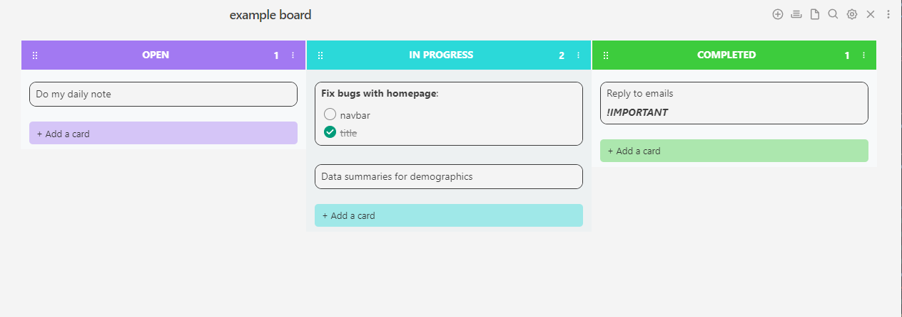
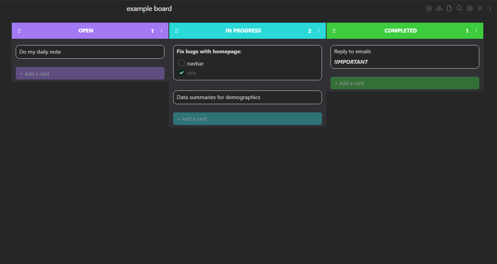

# Obsidian CSS Snippet -  Kanban Board 

A CSS snippet to enhance the Obsidian Kanban plugin (https://github.com/mgmeyers/obsidian-kanban)
This CSS snippet will allow a nice and simple design for your kanban board! 

Inspiration from modern kanban apps.

***Compatibility:***
- Currently supports 4 columns out of the box (see below how to add more - it's simple!)
- The last column will always be the green one (for completed)
- Dark mode/Light mode compatibility

### Light Mode:


### Dark Mode:


## How to customise the snippet:

### Lane colors:
To customise the color of each lane, you can simply just edit the colors in the ".theme-light" and ".theme-dark" at the top of the script. The color variables are labeled for easy editing and are in the following format:

--kban-col-open: r, g, b;

The variable below this will then calculate a lighter opacity to be used as the "add-card" colors.

### Add more lanes:
Currently, the snippet allows for 4 colored lanes where the last one is always green (--kban-col-completed). To add more, simply just navigate to the bottom of the script under the section "Lane Colours" and duplicate the "Inbox Lane" section and change the colour. For example, the next one would be:

```
.kanban-plugin__lane-wrapper:nth-last-child(6) .kanban-plugin__lane-header-wrapper 
```

***Numbering of nth-last-child:***
Using this method allows me to have the last column always green (for completed). The higher the number, the further to the left it is, and the last column is 2 (because this plugin has a hidden placeholder).


